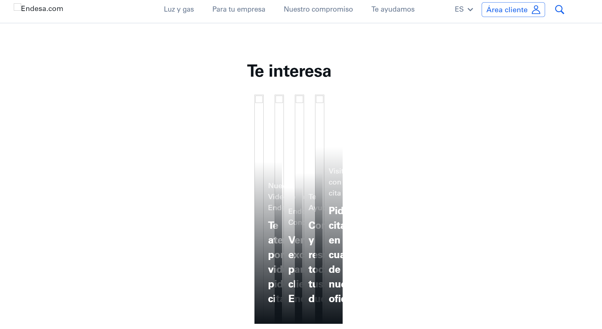
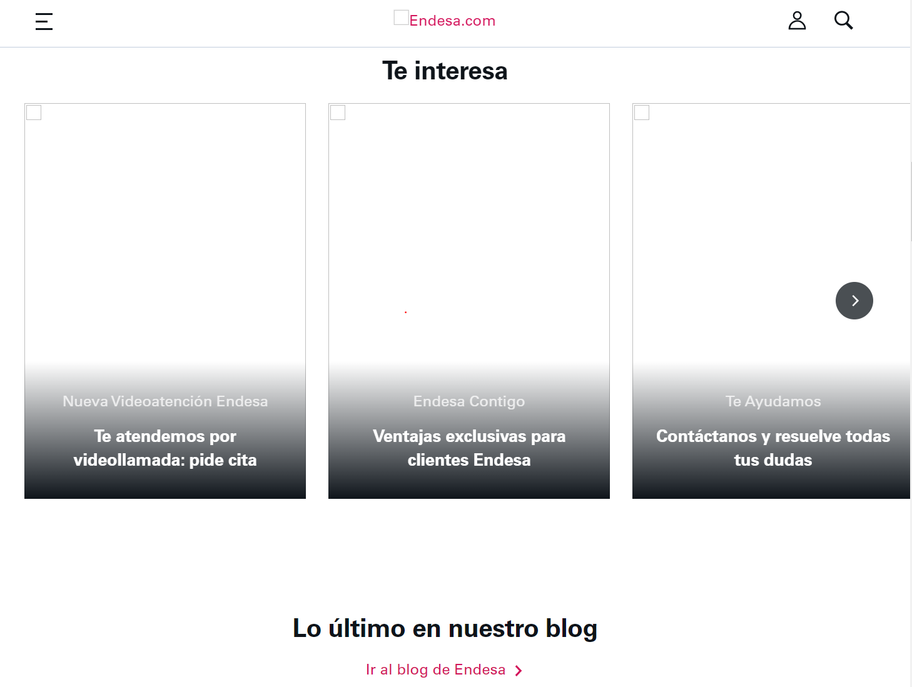
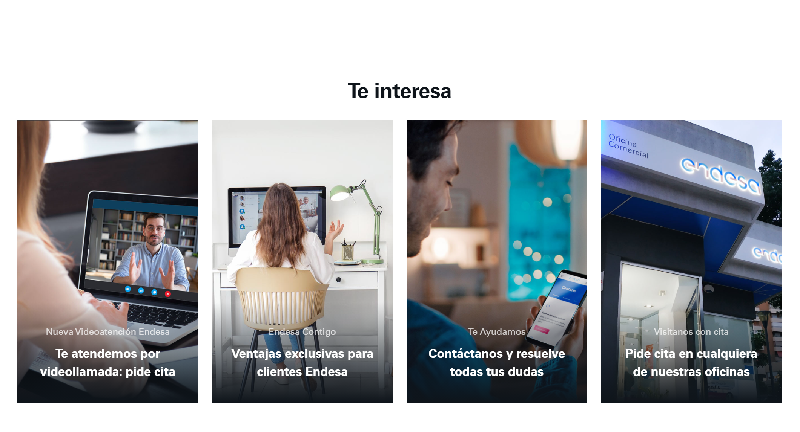

En esta revisión se lleva a cabo la evaluación de accesibilidad de la página de inicio del sitio web de [Endesa](https://www.endesa.com/es).

La revisión se ha realizado con la ayuda de la herramienta de excel proporcionada.

**Observaciones:**

Queremos destacar la consideración de que la página falla en el criterio **1.4.10 - Reflow** ya que, aunque a simple vista parece que lo cumple, hemos probado a deshabilitar las imagenes en el sitio web dándonos cuenta que, sin las imágenes, el contenido de las tarjetas se muestra incorrectamente y se pierde información dependiendo de tamaño de la página (por lo tanto, no es del todo responsivo)

