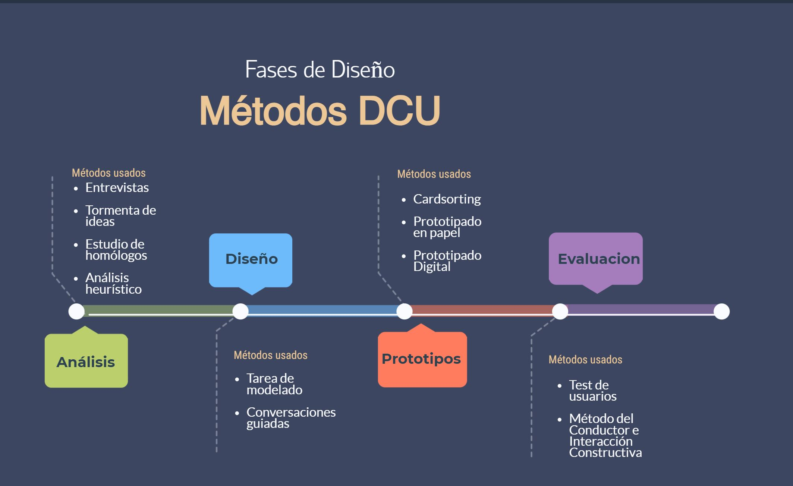

# Seminario DCU (Primera tarea)

## ACOIDAN MESA HERNANDEZ - alu0101206479@ull.edu.es
## RAÚL MARTÍN RIGOR - alu0101203003@ull.edu.es
## SERGIO LEOPOLDO BENÍTEZ DELGADO - alu0101244440@ull.edu.es

### 1. Indicar en el documento del ejemplo de aplicación del DCU, qué actividades se corresponden con el diagrama de Métodos DCU y en qué fase del diseño se ubica.

### 2. Aplicar el DCU para la realización de un prototipo de una aplicación web para la gestión y optimización del tiempo de estudio de un estudiante del Grado en Ingeniería Informática de la ULL. Para ello:

* Definir las tareas que se llevarán a cabo en la fase de investigación y diseño conceptual de la aplicación.

* Definir en el documento los personajes y perfiles de usuario que vayan a usar tu producto y la especificación de requisitos.
